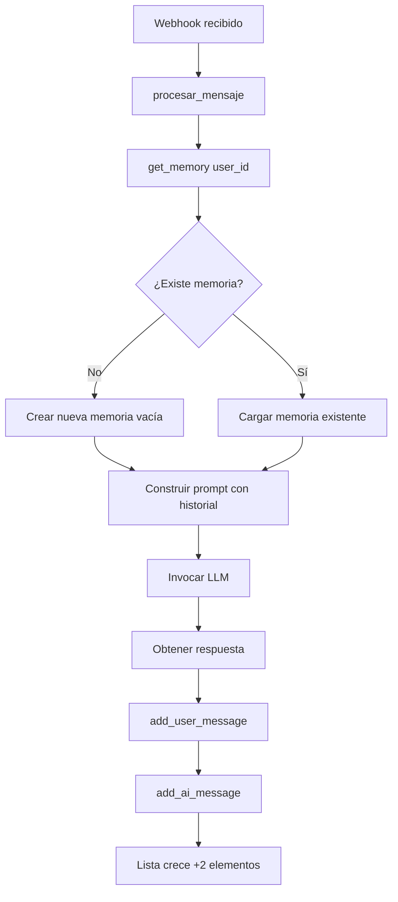

# Arquitectura de Memoria - Python Agent

## Resumen Ejecutivo

El sistema Python Agent **NO tiene límite de mensajes por conversación**. Todos los mensajes se almacenan en memoria RAM durante la vida del proceso.

## Especificaciones Técnicas

### Capacidad de Almacenamiento

```yaml
Tipo de almacenamiento: Memoria RAM (volátil)
Límite por conversación: ILIMITADO
Persistencia: NO (se pierde al reiniciar)
Indexación: Por user_id (JID de WhatsApp)
Estructura: Lista Python (List[Message])
```

### Estructura de Datos Detallada

```python
# Variable global en agent.py
user_memories: Dict[str, Memory] = {}

# Estructura por usuario
{
    "5491131376731@s.whatsapp.net": {
        "chat_memory": {
            "messages": [
                HumanMessage(content="Hola"),
                AIMessage(content="Hola! ¿En qué puedo ayudarte?"),
                HumanMessage(content="¿Cómo estás?"),
                AIMessage(content="Bien, gracias..."),
                # ... continúa sin límite
            ]
        }
    },
    "5491144125978@s.whatsapp.net": {
        # ... otra conversación independiente
    }
}
```

### Clase de Memoria (Implementación Interna)

```python
class _SimpleChatMemory:
    def __init__(self):
        self.messages: List = []  # ← Lista sin límite

    def add_user_message(self, text: str):
        self.messages.append(HumanMessage(content=text))

    def add_ai_message(self, text: str):
        self.messages.append(AIMessage(content=text))
```

**Ubicación en código**: `agent.py` líneas 193-202

## Flujo de Adición de Mensajes



**Código relevante** (`agent.py` líneas 440-444):

```python
# Guardar en memoria
memory.chat_memory.add_user_message(mensaje)  # +1 mensaje
memory.chat_memory.add_ai_message(respuesta)  # +1 mensaje
# Total: +2 mensajes por cada interacción
```

## Análisis de Consumo de Memoria

### Estimación por Mensaje

| Componente | Tamaño aproximado |
|------------|-------------------|
| Objeto `HumanMessage` | ~100 bytes (overhead) |
| Contenido texto corto (50 chars) | ~50 bytes |
| Contenido texto largo (500 chars) | ~500 bytes |
| **Total por mensaje corto** | ~150 bytes |
| **Total por mensaje largo** | ~600 bytes |

### Proyección de Uso

Suponiendo mensaje promedio de **250 caracteres**:

| Interacciones | Mensajes | Memoria/Usuario | 10 Usuarios | 100 Usuarios |
|---------------|----------|-----------------|-------------|--------------|
| 10 | 20 | 7.5 KB | 75 KB | 750 KB |
| 50 | 100 | 37.5 KB | 375 KB | 3.75 MB |
| 100 | 200 | 75 KB | 750 KB | 7.5 MB |
| 500 | 1,000 | 375 KB | 3.75 MB | 37.5 MB |
| 1,000 | 2,000 | 750 KB | 7.5 MB | 75 MB |
| 5,000 | 10,000 | 3.75 MB | 37.5 MB | 375 MB |
| 10,000 | 20,000 | 7.5 MB | 75 MB | 750 MB |

### Escenario Crítico

**Caso de uso intensivo**:
- 500 usuarios activos
- 1,000 interacciones promedio por usuario
- 2,000 mensajes guardados por usuario

**Consumo total**: 500 usuarios × 3.75 MB = **1.875 GB de RAM**

## Comportamiento en Tiempo de Ejecución

### Ciclo de Vida

```
1. Inicio del agente
   ↓
   user_memories = {}  (diccionario vacío)
   
2. Primer mensaje de usuario A
   ↓
   user_memories["A"] = nueva memoria vacía
   
3. Procesamiento
   ↓
   messages = [HumanMessage("..."), AIMessage("...")]
   
4. Mensajes subsecuentes
   ↓
   messages.append(HumanMessage("..."))
   messages.append(AIMessage("..."))
   # Lista crece indefinidamente
   
5. Reinicio del agente
   ↓
   ¡TODO SE PIERDE! → user_memories = {}
```

### Ejemplo Real (Verificado)

```bash
# Después de enviar 3 mensajes de prueba
curl http://localhost:5000/memory
```

**Resultado**:
```json
{
  "5491131376731@s.whatsapp.net": 6
}
```

**Interpretación**:
- 3 mensajes del usuario → 3 `HumanMessage`
- 3 respuestas del agente → 3 `AIMessage`
- **Total**: 6 mensajes en memoria

## Limitaciones y Riesgos

### ⚠️ Riesgos en Producción

1. **Fuga de memoria (Memory Leak)**
   - La lista crece indefinidamente
   - Sin mecanismo de limpieza automática
   - Puede causar OOM (Out Of Memory) en servidor

2. **Pérdida de datos al reiniciar**
   - No hay persistencia en disco
   - Cada restart = pérdida total del contexto

3. **Context Window excedido**
   - LLMs tienen límite de tokens
   - Sin límite de mensajes, puede enviar más tokens de los soportados
   - Causará errores en la invocación del LLM

4. **Escalabilidad horizontal imposible**
   - Estado en memoria de proceso único
   - No puede distribuirse entre múltiples instancias

### ⚠️ Situaciones de Fallo

```python
# Escenario 1: Usuario muy conversador
Usuario envía 10,000 mensajes
→ Lista tiene 20,000 elementos
→ Cada invocación del LLM procesa 20,000 mensajes
→ Error: "Context length exceeded"

# Escenario 2: Muchos usuarios
500 usuarios × 5,000 mensajes = 2.5M mensajes
→ ~1 GB de RAM solo para memoria conversacional
→ Servidor con 2GB RAM → OOM Kill

# Escenario 3: Restart inesperado
Servidor reinicia por update/crash
→ user_memories = {}
→ Usuarios pierden todo el contexto
```

## Soluciones Recomendadas

### Solución 1: Ventana Deslizante (Quick Win)

**Implementación sugerida**:

```python
# En agent.py, añadir constante
MAX_MESSAGES_PER_CONVERSATION = 50  # 25 intercambios

# Modificar get_memory() o procesar_mensaje()
def limit_memory(memory):
    if len(memory.chat_memory.messages) > MAX_MESSAGES_PER_CONVERSATION:
        # Mantener solo los últimos N mensajes
        memory.chat_memory.messages = memory.chat_memory.messages[-MAX_MESSAGES_PER_CONVERSATION:]
    return memory
```

**Llamar después de añadir mensajes**:

```python
memory.chat_memory.add_user_message(mensaje)
memory.chat_memory.add_ai_message(respuesta)
memory = limit_memory(memory)  # ← Truncar aquí
```

**Pros**:
- Implementación simple (5 líneas)
- Garantiza límite máximo de memoria
- No requiere infraestructura adicional

**Contras**:
- Pierde contexto antiguo
- Sigue sin persistencia

### Solución 2: Persistencia en Redis

**Arquitectura**:

```python
import redis
import json

redis_client = redis.Redis(host='localhost', port=6379, db=0)

def save_memory(user_id, messages):
    # Serializar mensajes
    data = [
        {"role": type(m).__name__, "content": m.content}
        for m in messages[-100:]  # Últimos 100
    ]
    redis_client.setex(
        f"conversation:{user_id}",
        86400,  # TTL 24 horas
        json.dumps(data)
    )

def load_memory(user_id):
    data = redis_client.get(f"conversation:{user_id}")
    if not data:
        return []
    messages = []
    for msg in json.loads(data):
        if msg["role"] == "HumanMessage":
            messages.append(HumanMessage(content=msg["content"]))
        else:
            messages.append(AIMessage(content=msg["content"]))
    return messages
```

**Pros**:
- Persistencia entre reinicios
- TTL automático (limpieza)
- Escalable horizontalmente

**Contras**:
- Requiere servidor Redis
- Mayor complejidad

### Solución 3: Resumen con LLM (Avanzado)

**Concepto**:

```python
async def summarize_old_messages(messages):
    # Cuando llegue a 100 mensajes:
    old_messages = messages[:80]
    recent_messages = messages[80:]
    
    # Usar LLM para resumir los 80 antiguos
    summary = await llm.invoke([
        SystemMessage("Resume esta conversación en 3-4 oraciones"),
        *old_messages
    ])
    
    # Reemplazar con un solo mensaje de resumen
    return [
        SystemMessage(content=f"Resumen de conversación anterior: {summary.content}"),
        *recent_messages
    ]
```

**Pros**:
- Mantiene contexto semántico
- Control preciso de memoria
- No pierde información crítica

**Contras**:
- Requiere llamadas adicionales al LLM (costo)
- Complejidad alta
- Latencia adicional

## Monitoreo y Alertas

### Métricas Recomendadas

```python
# Añadir endpoint de métricas
@app.get("/metrics")
async def metrics():
    total_users = len(user_memories)
    total_messages = sum(
        len(mem.chat_memory.messages)
        for mem in user_memories.values()
    )
    avg_messages = total_messages / total_users if total_users > 0 else 0
    
    # Estimar uso de RAM
    estimated_ram_mb = (total_messages * 300) / (1024 * 1024)
    
    return {
        "total_users": total_users,
        "total_messages": total_messages,
        "avg_messages_per_user": avg_messages,
        "estimated_ram_mb": estimated_ram_mb
    }
```

### Alertas Sugeridas

```yaml
# Configurar alertas cuando:
- total_messages > 50,000
- estimated_ram_mb > 500
- avg_messages_per_user > 1,000
- single_user_messages > 5,000
```

## Comandos de Utilidad

```bash
# Ver estado actual de memoria
curl http://localhost:5000/memory | jq 'to_entries | length'  # Cantidad usuarios
curl http://localhost:5000/memory | jq 'add'  # Total mensajes

# Ver usuario con más mensajes
curl http://localhost:5000/memory | jq 'to_entries | max_by(.value)'

# Reiniciar agente (limpia memoria)
pkill -f agent.py
./venv/bin/python agent.py > agent.log 2>&1 &
```

## Conclusión

El sistema actual almacena **TODOS los mensajes en memoria RAM sin límite**. Esto es adecuado para:

✅ Desarrollo y pruebas  
✅ Despliegues pequeños (<50 usuarios)  
✅ Conversaciones cortas (<100 mensajes por usuario)

❌ **NO es adecuado para**:
- Producción de alto volumen
- Conversaciones largas o múltiples usuarios
- Ambientes de 24/7 sin reinicios

**Acción recomendada inmediata**: Implementar Solución 1 (Ventana Deslizante) antes de desplegar en producción.
