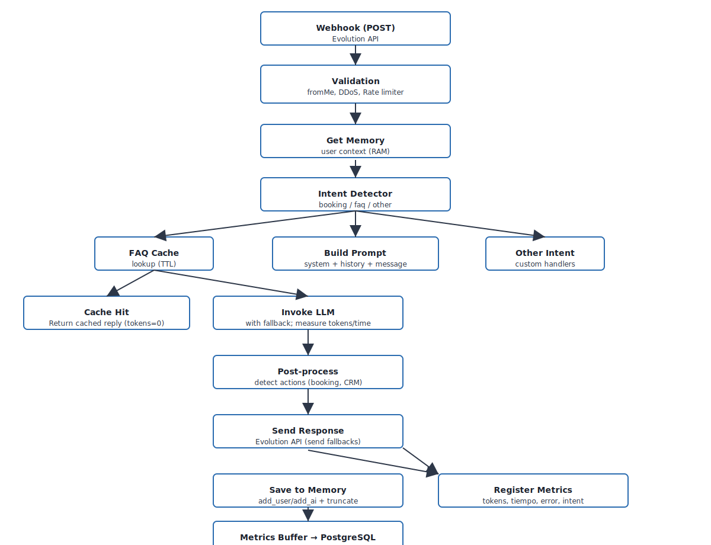

# Python Agent - Asistente Virtual WhatsApp con LLM

## Descripción General

Sistema de agente conversacional inteligente que integra WhatsApp (vía Evolution API) con modelos de lenguaje (LLM) y Google Calendar. Permite mantener conversaciones contextuales con gestión automática de memoria, sistema de reservas simplificado y finalización inteligente de conversaciones.

### Características Principales

- ✅ **Gestión de Memoria con Rotación**: Límite de 50 mensajes por conversación con ventana deslizante
- ✅ **Sistema de Reservas Simplificado**: Link directo a página de reservas de Google Calendar
- ✅ **Finalización Inteligente**: No responde a saludos/agradecimientos después de enviar el link de reserva
- ✅ **Protección DDoS Multi-Capa**: 5 capas de protección contra ataques volumétricos con múltiples números
- ✅ **Sistema de Fallback LLM**: Respaldo automático a proveedor secundario en caso de fallo del principal
- ✅ **Logging con Rotación**: Máximo 50 MB de logs con 5 archivos de respaldo
- ✅ **Multi-LLM**: Soporte para HuggingFace, Anthropic, OpenAI y Google Gemini
- ✅ **Script de Gestión**: Herramienta completa para iniciar/detener/monitorear el agente

## Arquitectura del Sistema

### Componentes Principales

```
┌─────────────────┐
│   WhatsApp      │
│   (Usuario)     │
└────────┬────────┘
         │ Webhook
         ▼
┌─────────────────────────────────────────┐
│      Evolution API                      │
│   (https://evoapi.sisnova.com.ar)       │
└────────┬────────────────────────────────┘
         │ POST /webhook
         ▼
┌─────────────────────────────────────────┐
│   Python Agent (FastAPI)                │
│   - Recepción de webhooks               │
│   - Gestión de memoria conversacional   │
│   - Procesamiento con LLM               │
│   - Integración Google Calendar         │
└────────┬────────────────────────────────┘
         │
         ├─► LLM (HuggingFace/Anthropic/OpenAI)
         └─► Google Calendar API
```

### Stack Tecnológico

- **Framework Web**: FastAPI + Uvicorn (ASGI)
- **HTTP Client**: httpx (async), requests (sync)
- **LLM Framework**: LangChain
- **Proveedores LLM**: HuggingFace (Qwen2.5-7B-Instruct - por defecto), Anthropic Claude, OpenAI, Google Gemini
- **Storage**: Memoria RAM (en proceso) con límite de 50 mensajes por conversación
- **Logging**: Python logging con RotatingFileHandler (10 MB por archivo, 5 archivos de respaldo)
- **Integraciones**: Evolution API (WhatsApp), Google Calendar Booking Pages

## Instalación

### Requisitos Previos

- Python 3.12.3+
- Cuenta en Evolution API
- API Key de al menos un proveedor LLM (HuggingFace, Anthropic, OpenAI)
- (Opcional) Credenciales de Google Calendar API

### Pasos de Instalación

```bash
# 1. Crear entorno virtual
python3 -m venv venv
source venv/bin/activate  # En Windows: venv\Scripts\activate

# 2. Instalar dependencias
pip install -r requirements.txt

# 3. Configurar variables de entorno
cp .env.example .env
# Editar .env con tus credenciales

# 4. Ejecutar el agente
./venv/bin/python agent.py
```

## Configuración

### Variables de Entorno (.env)

```ini
# LLM Configuration
LLM_PROVIDER=gemini                # Opciones: gemini, huggingface, anthropic, openai, ollama
LLM_PROVIDER_FALLBACK=openai       # Proveedor de respaldo en caso de fallo del principal

# API Keys para diferentes proveedores
GEMINI_API_KEY=AIzaSyAxxxxx...     # Para Google Gemini
HF_MODEL=Qwen/Qwen2.5-7B-Instruct  # Modelo de HuggingFace (si LLM_PROVIDER=huggingface)
HUGGINGFACE_API_KEY=hf_xxxxx...
ANTHROPIC_API_KEY=sk-ant-xxxxx...
OPENAI_API_KEY=sk-xxxxx...

# Evolution API (WhatsApp)
EVOLUTION_API_URL=https://evoapi.sisnova.com.ar
EVOLUTION_API_KEY=9d15c6d04d216cc8becc3721d8199c20
EVOLUTION_INSTANCE=prueba-py-agent
EVOLUTION_INSTANCE_ID=b6b78f87-1d77-49b2-8164-1c68b6b42c40

# Google Calendar (opcional - solo para booking pages)
GOOGLE_BOOKING_URL=https://calendar.app.google/uxYJoEeZvCWoT3269

# Configuración de Memoria
MAX_MESSAGES=50  # Límite de mensajes por conversación (default: 50)

# Protección DDoS
DDOS_GLOBAL_MAX_RPM=100           # Límite global de mensajes por minuto (default: 100)
DDOS_MAX_NEW_NUMBERS_PM=20        # Máximo de números nuevos por minuto (default: 20)
DDOS_SUSPICIOUS_THRESHOLD=10      # Umbral para activar modo sospechoso (default: 10)
DDOS_OWNER_NUMBERS=5491131376731  # Números siempre permitidos (separados por coma)

# Integración con Krayin CRM
KRAYIN_API_URL=https://your-krayin-instance.com/api/v1
KRAYIN_API_TOKEN=your_api_token_here
KRAYIN_PIPELINE_ID=1  # ID del pipeline de leads
KRAYIN_STAGE_ID=1  # ID de la etapa "Nuevo Lead"
KRAYIN_USER_ID=1  # ID del usuario asignado
KRAYIN_LEAD_SOURCE_ID=5  # ID de la fuente (ej: WhatsApp)
KRAYIN_LEAD_TYPE_ID=1  # ID del tipo de lead
CRM_AUTO_REGISTER=true  # true para activar registro automático al reservar

# Webhook de Monitoreo (opcional)
MONITORING_WEBHOOK_URL=https://monitoring.example.com/webhook  # URL para enviar métricas
MONITORING_WEBHOOK_INTERVAL_MINUTES=60  # Intervalo de envío automático (default: 60 minutos)
```

### Modo de Webhook: Pull vs Push

El agente soporta dos modos de integración con sistemas de monitoreo:

- `pull` (por defecto): el agente envía métricas periódicamente al `MONITORING_WEBHOOK_URL`.
- `push`: el sistema de monitoreo realiza `POST` al agente en el endpoint `/monitoring/push` con las métricas.

Para activar el modo `push`, establezca en su archivo `.env`:

```ini
MONITORING_WEBHOOK_MODE=push
# (Opcional) token que el sistema de monitoreo debe enviar en el header X-MONITORING-TOKEN
MONITORING_PUSH_TOKEN=un_token_secreto
```

Comportamiento en `push`:

- El agente NO iniciará el scheduler automático que envía métricas al webhook externo.
- El endpoint receptor es `POST /monitoring/push` y acepta JSON. Si se configura `MONITORING_PUSH_TOKEN`, el agente validará el header `X-MONITORING-TOKEN`.
- Los payloads recibidos se almacenan en disco en `logs/monitoring_received/` con nombre `<timestamp>_<uuid>.json` para procesamiento posterior.

Ejemplo de curl (modo push, con token):

```bash
curl -X POST http://YOUR_AGENT_IP:5000/monitoring/push \
  -H "Content-Type: application/json" \
  -H "X-MONITORING-TOKEN: un_token_secreto" \
  -d '{
    "timestamp": "2026-01-26T00:00:00Z",
    "source": "monitoring",
    "stats_general": {"messages": 123, "errors": 2},
    "stats_hourly": [{"hour": "2026-01-25T23:00:00Z", "messages": 10}],
    "top_users": [],
    "periodo": "mes_2026-01"
  }'
```

Respuesta esperada: `200 OK` con JSON indicando `accepted` y la ruta donde se almacenó el payload.

Notas adicionales:

- Si desea que el agente siga enviando métricas (modo `pull`) deje `MONITORING_WEBHOOK_MODE` vacío o en `pull` y configure `MONITORING_WEBHOOK_URL`.
- Puede forzar manualmente el envío desde el agente (modo `pull`) con el endpoint administrativo: `POST /admin/metrics/webhook?mes_actual=true`.
- En entornos productivos configure `MONITORING_PUSH_TOKEN` para proteger el endpoint `POST /monitoring/push`.


### Configuración de Webhook en Evolution API

```bash
curl -X POST https://evoapi.sisnova.com.ar/webhook/set/prueba-py-agent \
  -H "Content-Type: application/json" \
  -H "apikey: YOUR_API_KEY" \
  -d '{
    "url": "http://YOUR_SERVER_IP:5000/webhook",
    "webhook_by_events": false,
    "webhook_base64": false,
    "events": ["MESSAGES_UPSERT"]
  }'

  curl -X POST https://evoapi.sisnova.com.ar/webhook/set/prueba-py-agent -H "Content-Type: application/json" -H "apikey: 9d15c6d04d216cc8becc3721d8199c20" -d '{"webhook":{"url":"http://sisagent_cliente1_sisagent:5000/webhook","enabled":true,"webhookByEvents":false,"webhookBase64":false,"events":["MESSAGES_UPSERT"]}}' && echo ''
```

## Gestión de Memoria Conversacional

### Arquitectura de Memoria

El sistema implementa un sistema de memoria **en RAM por usuario** con límite de **50 mensajes por conversación**:

#### Estructura de Datos

```python
user_memories: Dict[str, Memory] = {}

# Cada entrada contiene:
{
  "user_id": {
    "chat_memory": {
      "messages": [
        HumanMessage(content="..."),
        AIMessage(content="..."),
        ...
      ]
    }
  }
}
```

#### Implementación

**Ubicación en código**: `agent.py` líneas 181-234

```python
# Límite configurable vía variable de entorno
MAX_MESSAGES_PER_CONVERSATION = int(os.getenv("MAX_MESSAGES", "50"))

def get_memory(user_id: str):
    """Obtiene o crea memoria para un usuario"""
    if user_id not in user_memories:
        # Fallback: almacenar mensajes en memoria RAM
        class _SimpleChatMemory:
            def __init__(self):
                self.messages: List = []  # Lista con truncado automático

            def add_user_message(self, text: str):
                self.messages.append(HumanMessage(content=text))

            def add_ai_message(self, text: str):
                self.messages.append(AIMessage(content=text))

def truncate_memory(memory):
    """Trunca la memoria si excede el límite configurado"""
    current_count = len(memory.chat_memory.messages)
    if current_count > MAX_MESSAGES_PER_CONVERSATION:
        # Mantener solo los últimos MAX_MESSAGES_PER_CONVERSATION mensajes
        memory.chat_memory.messages = memory.chat_memory.messages[-MAX_MESSAGES_PER_CONVERSATION:]
        logger.info(f"Truncated memory: {current_count} → {MAX_MESSAGES_PER_CONVERSATION} messages")
```

### Capacidad de Almacenamiento

| Aspecto | Detalle |
|---------|---------|
| **Límite por conversación** | ✅ **50 mensajes** (25 intercambios) - Configurable vía MAX_MESSAGES |
| **Truncado automático** | ✅ **Ventana deslizante** - Mantiene los últimos 50 mensajes |
| **Persistencia** | ❌ **No persistente** - Se pierde al reiniciar el agente |
| **Scope** | Por `user_id` (número de WhatsApp con JID) |
| **Tipo de almacenamiento** | Lista Python en memoria RAM |
| **Formato de mensajes** | Par Usuario/Asistente por cada interacción |
| **Conteo** | 2 mensajes por interacción (pregunta + respuesta) |

#### Ejemplo de Uso de Memoria por Usuario

| Interacciones | Mensajes guardados | Uso estimado RAM |
|---------------|-------------------|------------------|
| 10 | 20 (10 user + 10 AI) | ~5 KB |
| 25 (límite) | **50 (truncado automático)** | ~12 KB |
| 100+ | **50 (se descartan los más antiguos)** | ~12 KB |

**Usuarios simultáneos**:

| Usuarios activos | Memoria total (50 msg/usuario) |
|------------------|--------------------------------|
| 100 | ~1.2 MB |
| 1,000 | ~12 MB |
| 10,000 | ~120 MB |

**✅ IMPLEMENTADO**: Ventana deslizante automática que mantiene solo los últimos 50 mensajes por conversación.

**⚠️ RECOMENDACIONES ADICIONALES**:
1. **Persistencia**: Guardar en base de datos (Redis, PostgreSQL) para recuperar historial
2. **Expiración**: Limpiar conversaciones inactivas después de X horas
3. **Compresión**: Resumir mensajes antiguos con LLM antes de truncar

### Adición y Truncado de Mensajes

**Ubicación en código**: `agent.py` líneas 440-470 (en función `procesar_mensaje`)

```python
# Guardar en memoria
memory.chat_memory.add_user_message(mensaje)
memory.chat_memory.add_ai_message(respuesta)

# Truncar memoria si excede el límite
truncate_memory(memory)
```

Cada llamada a `procesar_mensaje()` añade **2 mensajes** a la lista:
1. El mensaje del usuario (`HumanMessage`)
2. La respuesta del asistente (`AIMessage`)

Luego, `truncate_memory()` verifica si se excedió el límite de 50 mensajes y automáticamente descarta los más antiguos, manteniendo solo los últimos 50.

**Logs de truncado**:
```
2026-01-20 10:15:23 INFO python-agent: Truncated memory: 52 → 50 messages
```

## Sistema de Fallback para Proveedores LLM

### Descripción

El sistema implementa un mecanismo de respaldo automático que permite cambiar a un proveedor LLM secundario en caso de que el proveedor principal falle. Esto mejora la disponibilidad del servicio y previene interrupciones cuando:

- El proveedor principal agota su cuota (429 RESOURCE_EXHAUSTED)
- Hay problemas de conectividad con la API del proveedor
- El servicio del proveedor está temporalmente fuera de línea
- Se exceden los límites de rate limiting

### Configuración

**Variables de entorno**:

```ini
# Proveedor LLM principal
LLM_PROVIDER=gemini

# Proveedor de respaldo (se usa automáticamente si el principal falla)
LLM_PROVIDER_FALLBACK=openai
```

### Flujo de Funcionamiento

```
┌─────────────────────────────────────────────────┐
│  Usuario envía mensaje                          │
└────────────┬────────────────────────────────────┘
             │
             ▼
┌─────────────────────────────────────────────────┐
│  Intento con Proveedor Principal (gemini)       │
└────────┬────────────────────────────────────┬───┘
         │ Éxito                              │ Error
         ▼                                    ▼
┌──────────────────┐          ┌─────────────────────────────────┐
│  Respuesta al    │          │  Log: Error con proveedor       │
│  usuario         │          │  principal                      │
└──────────────────┘          └────────────┬────────────────────┘
                                           │
                                           ▼
                              ┌─────────────────────────────────┐
                              │  Intento con Fallback (openai)  │
                              └────────┬────────────────────┬───┘
                                       │ Éxito              │ Error
                                       ▼                    ▼
                              ┌──────────────────┐  ┌──────────────────┐
                              │  Respuesta al    │  │  Mensaje de      │
                              │  usuario         │  │  error genérico  │
                              └──────────────────┘  └──────────────────┘
```

### Implementación

**Ubicación en código**: `agent.py`

#### 1. Función `get_llm_model()` modificada (líneas 395-405)

```python
def get_llm_model(provider_override=None):
    """Retorna el modelo LLM según la configuración
    
    Args:
        provider_override: Si se especifica, usa este provider en lugar del configurado
    """
    provider = (provider_override or LLM_PROVIDER).lower()
    logger.debug("Configuring LLM provider: %s", provider)
    
    # ... resto de la implementación
```

#### 2. Lógica de fallback en `procesar_mensaje()` (líneas ~710-735)

```python
# Invocar LLM con sistema de fallback
try:
    respuesta_llm = agente.invoke(messages)
    respuesta = respuesta_llm.content
except Exception as llm_error:
    logger.error(f"Error con LLM provider principal ({LLM_PROVIDER}): {llm_error}")
    
    # Intentar con el fallback si está configurado
    fallback_provider = os.getenv('LLM_PROVIDER_FALLBACK', '').strip()
    if fallback_provider and fallback_provider.lower() != LLM_PROVIDER.lower():
        logger.warning(f"⚠️ Intentando con proveedor de respaldo: {fallback_provider}")
        try:
            # Obtener instancia del LLM de fallback
            agente_fallback = get_llm_model(provider_override=fallback_provider)
            respuesta_llm = agente_fallback.invoke(messages)
            respuesta = respuesta_llm.content
            logger.info(f"✅ Respuesta exitosa con proveedor de respaldo: {fallback_provider}")
        except Exception as fallback_error:
            logger.error(f"❌ Error también con proveedor de respaldo ({fallback_provider}): {fallback_error}")
            return "Gracias por contactarnos. En este momento estamos experimentando dificultades técnicas..."
    else:
        logger.error("❌ No hay proveedor de respaldo configurado o es el mismo que el principal")
        return "Gracias por contactarnos. En este momento estamos experimentando dificultades técnicas..."
```

### Ejemplo de Logs

**Caso exitoso con proveedor principal**:
```
2026-01-22 23:10:45 DEBUG python-agent: Configuring LLM provider: gemini
2026-01-22 23:10:46 INFO python-agent: [RESPUESTA DEL LLM]: Hola 👋 ¡Gracias por escribirnos!
```

**Caso con fallback (proveedor principal falló)**:
```
2026-01-22 23:15:30 DEBUG python-agent: Configuring LLM provider: gemini
2026-01-22 23:15:32 ERROR python-agent: Error con LLM provider principal (gemini): 429 RESOURCE_EXHAUSTED
2026-01-22 23:15:32 WARNING python-agent: ⚠️ Intentando con proveedor de respaldo: openai
2026-01-22 23:15:32 DEBUG python-agent: Configuring LLM provider: openai
2026-01-22 23:15:34 INFO python-agent: ✅ Respuesta exitosa con proveedor de respaldo: openai
2026-01-22 23:15:34 INFO python-agent: [RESPUESTA DEL LLM]: Hola 👋 ¡Gracias por escribirnos!
```

**Caso con ambos proveedores fallando**:
```
2026-01-22 23:20:10 ERROR python-agent: Error con LLM provider principal (gemini): Connection timeout
2026-01-22 23:20:10 WARNING python-agent: ⚠️ Intentando con proveedor de respaldo: openai
2026-01-22 23:20:12 ERROR python-agent: ❌ Error también con proveedor de respaldo (openai): Invalid API key
2026-01-22 23:20:12 INFO python-agent: [RESPUESTA]: Gracias por contactarnos. En este momento estamos experimentando dificultades técnicas...
```

### Configuraciones Recomendadas

| Proveedor Principal | Proveedor Fallback | Razón |
|---------------------|-------------------|-------|
| `gemini` | `openai` | ✅ Gemini (gratuito) con OpenAI como respaldo confiable |
| `huggingface` | `openai` | ✅ HuggingFace (gratuito) con OpenAI de respaldo |
| `anthropic` | `gemini` | ✅ Claude con Gemini como alternativa económica |
| `openai` | `gemini` | ✅ OpenAI premium con Gemini gratuito de respaldo |

### Ventajas del Sistema

1. **Mayor disponibilidad**: El servicio continúa funcionando aunque un proveedor falle
2. **Ahorro de costos**: Usa proveedores gratuitos/económicos como principal y paga solo cuando fallan
3. **Gestión de cuotas**: Evita interrupciones cuando se agota la cuota del proveedor gratuito
4. **Logging completo**: Visibilidad total del comportamiento para debugging
5. **Sin cambios manuales**: Todo es automático, no requiere intervención
6. **Configuración simple**: Solo requiere dos variables de entorno

### Consideraciones

⚠️ **Importante**:
- El fallback solo se activa si el proveedor principal falla completamente
- Ambos proveedores deben tener sus API keys configuradas
- El fallback debe ser diferente del principal (se verifica automáticamente)
- Cada cambio de proveedor registra logs para auditoría

---------------------------------------------------------------
### Monitoreo de Memoria

#### Endpoints Disponibles

##### 1. Lista de usuarios en memoria
```bash
GET http://localhost:5000/memory
```

**Respuesta**:
```json
{
  "5491131376731@s.whatsapp.net": 6,
  "5491144125978@s.whatsapp.net": 14
}
```

##### 2. Detalle de memoria por usuario
```bash
GET http://localhost:5000/memory/5491131376731@s.whatsapp.net
```

**Respuesta**:
```json
{
  "user_id": "5491131376731@s.whatsapp.net",
  "count": 6,
  "messages": [
    {"role": "HumanMessage", "content": "Hola"},
    {"role": "AIMessage", "content": "Hola! Recibí tu mensaje..."},
    {"role": "HumanMessage", "content": "¿Cómo estás?"},
    {"role": "AIMessage", "content": "Hola! Recibí tu mensaje..."}
  ]
}
```

-------------------------------------------------------------
## API Endpoints

### Webhook Receiver

Ejemplo con `curl` (simula un webhook entrante):

```bash
curl -sS -X POST http://localhost:5000/webhook \
  -H "Content-Type: application/json" \
  -d '{
    "event": "messages.upsert",
    "instance": "prueba-py-agent",
    "data": {
      "key": {
        "remoteJid": "5491131376731@s.whatsapp.net",
        "fromMe": false
      },
      "message": {
        "conversation": "Hola, necesito ayuda"
      }
    }
  }'
```

**Comportamiento**:
1. Extrae mensaje y remitente
2. Verifica que `fromMe=false` (no procesar mensajes propios)
3. Obtiene memoria del usuario
4. Invoca LLM con contexto completo
5. Envía respuesta vía Evolution API
6. Guarda intercambio en memoria

### Health Check

```bash
curl -sS http://localhost:5000/health
```

**Respuesta**: {"status": "ok"}

---------------------------------------------------
## Métricas (Metric Endpoints)

Ejemplos de uso de los endpoints de métricas para diagnóstico y monitoreo.

- Obtener estadísticas generales (últimas 24 horas por defecto):

```bash
curl -sS "http://localhost:5000/stats?horas=24"
```

Respuesta de ejemplo:

```json
{
  "periodo_horas": 24,
  "total_mensajes": 10,
  "mensajes_exitosos": 10,
  "mensajes_error": 0,
  "mensajes_cache": 0,
  "tasa_exito_porcentaje": 100.0,
  "tiempo_promedio_segundos": 0.91,
  "tokens_totales": 1182,
  "usuarios_unicos": 10
}
```

- Obtener métricas agregadas por hora:

```bash
curl -sS "http://localhost:5000/stats/hourly?horas=24"
```

Respuesta de ejemplo (array):

```json
[{
  "hora": "2026-01-25T19:00:00",
  "total_mensajes": 10,
  "exitosos": 10,
  "errores": 0,
  "cache": 0,
  "tiempo_promedio": 0.91,
  "tokens": 1182,
  "usuarios": 10
}]
```

Consulta por rango de fechas (ISO):

```bash
# Ejemplo: obtener métricas horarias entre el 1 y 31 de enero de 2026
curl -sS "http://localhost:5000/stats/hourly?start=2026-01-01T00:00:00&end=2026-01-31T23:59:59" | jq
```

Consulta general por rango (totales entre dos fechas):

```bash
# Estadísticas agregadas entre dos timestamps ISO
curl -sS "http://localhost:5000/stats?start=2026-01-01T00:00:00&end=2026-01-31T23:59:59" | jq
```

Nota: Alternativamente puedes usar `?horas=` con el total de horas del mes (30 días = 720, 31 días = 744), pero `start`/`end` permite rangos exactos y timezone-aware ISO timestamps.

- Obtener top usuarios más activos:

```bash
curl -sS "http://localhost:5000/stats/top-users?limit=10"
```

Respuesta de ejemplo (array):

```json
[{
  "user_id": "5491000000004@s.whatsapp.net",
  "total_mensajes": 1,
  "ultimo_mensaje": "2026-01-25T19:23:39.451762",
  "tiempo_promedio": 0.77,
  "tasa_error": 0.0
}]
```

- Limpieza de métricas antiguas (acción administrativa):

```bash
curl -sS -X POST -H "Content-Type: application/json" \
  -d '{"dias":30}' http://localhost:5000/admin/cleanup
```

Respuesta de ejemplo:

```json
{"dias":30, "eliminados": 0}
```
- Limpieza completa de todas las métricas:
```bash
curl -sS -X POST -H "Content-Type: application/json" http://localhost:5000/admin/cleanup/all
```

Nota: `/admin/cleanup` debería estar protegido por autenticación en entornos de producción.

- Forzar flush del buffer de métricas (acción administrativa):
```bash
curl -sS -X POST -H "Content-Type: application/json" http://localhost:5000/admin/metrics/flush
```

Respuesta de ejemplo:

```json
{"buffer_before": 3, "inserted": 3}
```

Nota: Este endpoint fuerza que el buffer de métricas en memoria se inserte inmediatamente en la base de datos. Es útil para pruebas (por ejemplo después de un `TRUNCATE`) o para vaciar el buffer antes de reinicios. Protege este endpoint en producción (sugerencia: validar `X-ADMIN-TOKEN` contra `ADMIN_TOKEN` en el `.env`).

- Enviar métricas al webhook de monitoreo (acción administrativa):

```bash
# Disparar envío de métricas de las últimas 24 horas (por defecto)
curl -sS -X POST http://localhost:5000/admin/metrics/webhook

# Enviar métricas de las últimas 48 horas
curl -sS -X POST "http://localhost:5000/admin/metrics/webhook?horas=48"
```

Respuesta de ejemplo (éxito):

```json
{
  "success": true,
  "status_code": 200,
  "webhook_url": "https://monitoring.example.com/webhook",
  "periodo_horas": 24
}
```

Respuesta de ejemplo (error):

```json
{
  "success": false,
  "error": "Timeout (>10s)"
}
```
- Metrica de performance para determinar cantidad de réplicas necesarias (Prometheus format):

```bash
@app.route('/metrics', methods=['GET'])
def metricas_prometheus():
    """Métricas en formato Prometheus"""
    return f"""
# HELP mensajes_en_cola Mensajes esperando procesamiento
# TYPE mensajes_en_cola gauge
mensajes_en_cola {len(executor._threads)}

# HELP cpu_usage Uso de CPU
# TYPE cpu_usage gauge
cpu_usage {psutil.cpu_percent()}

# HELP memory_usage Uso de memoria MB
# TYPE memory_usage gauge
memory_usage {psutil.Process().memory_info().rss / 1024 / 1024}

# HELP mensajes_procesados_total Total de mensajes procesados
# TYPE mensajes_procesados_total counter
mensajes_procesados_total {metricas.mensajes_procesados}
"""
```
### **Indicadores para escalar:**
```
🔴 NECESITAS MÁS RÉPLICAS si:
- Mensajes en cola > 10 consistentemente
- CPU > 80% por más de 5 minutos
- Tiempo de respuesta > 30 segundos
- Errores de timeout frecuentes

🟢 PUEDES REDUCIR RÉPLICAS si:
- Mensajes en cola = 0 siempre
- CPU < 30% constantemente
- Réplicas > 1 y tráfico muy bajo
```

---

## 💰 Análisis de costos

### **Servidor dedicado ($50/mes - 8 cores, 16GB RAM):**

Configuración A: 10 clientes x 1 réplica
├── Recursos usados: 50-70%
├── Capacidad restante: 30-50%
├── Clientes que soporta: 10-12 ✅
└── Costo por cliente: $4-5/mes

Configuración B: 10 clientes x 2 réplicas
├── Recursos usados: 90-100%
├── Capacidad restante: 0-10%
├── Clientes que soporta: 10 máximo ⚠️
└── Costo por cliente: $5/mes

Configuración C: 5 clientes x 2 réplicas
├── Recursos usados: 50-60%
├── Capacidad restante: 40-50%
├── Clientes que soporta: 5-6 ✅
└── Costo por cliente: $8-10/mes (premium)
----------------------------------------------------------------------
## Configuración del webhook de monitoreo

Configura la URL del webhook y el intervalo de envío automático en `.env`:

```ini
# Webhook para sistema de monitoreo externo
MONITORING_WEBHOOK_URL=https://monitoring.example.com/webhook
MONITORING_WEBHOOK_INTERVAL_MINUTES=60  # Envío automático cada 60 minutos (default)
```

**Envío automático periódico**:

El agente envía automáticamente las métricas del mes en curso cada N minutos (configurable con `MONITORING_WEBHOOK_INTERVAL_MINUTES`). El scheduler se inicia automáticamente al arrancar el agente.

**Envío manual con diferentes períodos**:

```bash
# Enviar métricas de las últimas 24 horas
curl -X POST "http://localhost:5000/admin/metrics/webhook?horas=24"

# Enviar métricas de todo el mes en curso (mismo comportamiento que el scheduler)
curl -X POST "http://localhost:5000/admin/metrics/webhook?mes_actual=true"
```

El payload enviado al webhook incluye:

```json
{
  "timestamp": "2026-01-26T12:00:00",
  "source": "sisagent",
  "stats_general": { /* estadísticas generales */ },
  "stats_hourly": [ /* métricas por hora */ ],
  "top_users": [ /* usuarios más activos */ ],
  "periodo": "mes_2026-01"  // o "24h" según parámetros
}
```

Nota: Protege este endpoint en producción. El webhook tiene timeout de 10 segundos.

-------------------------------------------------------------------
## DDoS Protection Stats

```bash
curl -sS http://localhost:5000/ddos-stats
```

**Respuesta**:
```json
{
  "global_limiter": {
    "requests_last_minute": 45,
    "limit": 100,
    "oldest_timestamp": "2026-01-25 13:20:15"
  },
  "new_numbers": {
    "new_numbers_last_minute": 3,
    "limit": 20,
    "suspicious_mode": false,
    "known_numbers_count": 127
  },
  "circuit_breaker": {
    "state": "closed",
    "failure_count": 0,
    "last_failure": null
  },
  "blacklist": {
    "blacklist_count": 2,
    "whitelist_count": 1,
    "suspicious_count": 0
  }
}
```

----------------------------------------------------------------
## Flujo de Procesamiento de Mensajes

Resumen del flujo con `Intent_Detector`, `FAQ_Cache` y monitoreo (métricas):

1. Webhook recibido desde Evolution API
  - Validación inicial: `fromMe` y DDoS/rate limiter
2. Extracción de datos (remitente, mensaje)
3. `get_memory(user_id)` → cargar o crear memoria por usuario
4. Intent Detection
  - `intent = Intent_Detector.detect(mensaje)`
  - Si `intent == 'faq'` → consultar `FAQ_Cache`
    - Si `cache_hit`: devolver respuesta cacheada inmediatamente
     - Registrar métrica: `registrar_metrica(..., fue_cache=True, error=False, tokens_usados=0)`
     - Retornar respuesta cacheada
5. Construcción del prompt (si no hubo cache hit)
  - `system prompt` + mensajes históricos + nuevo mensaje
6. Invocación del LLM (con fallback automático)
  - Medir tiempo de procesamiento y extraer `tokens_usados`
  - Si error en proveedor principal → intentar `LLM_PROVIDER_FALLBACK`
7. Procesamiento de la respuesta del LLM
  - Detectar acciones (ej: `reserva`) y ejecutar side-effects (enviar link, registrar en CRM)
8. Envío de respuesta vía Evolution API
  - Usar candidatos de fallback (instance name, instance UUID, EVOLUTION_INSTANCE)
9. Persistencia y métricas
  - Guardar intercambio en memoria: `memory.chat_memory.add_user_message()` / `add_ai_message()`
  - Truncar memoria si excede `MAX_MESSAGES`
  - Registrar métrica de interacción:
    - `registrar_metrica(user_id, mensaje, inicio, intencion=intent, fue_cache=False, tokens=tokens_usados, error=False)`
  - El sistema usa buffer para métricas y `METRICS_BUFFER_SIZE` controla flush
10. Responder al webhook
  - Retornar `{"status": "success"}` o el error correspondiente

Diagrama ASCII del flujo:

```
┌─────────────────────────────────────────────────────────────────────────────────┐
│                         FLUJO DE PROCESAMIENTO DE MENSAJES                      │
└─────────────────────────────────────────────────────────────────────────────────┘

    ┌──────────────────┐
    │  Webhook (POST)  │
    │ Evolution API    │
    └────────┬─────────┘
             │
             ▼
    ┌──────────────────┐
    │  Validación DDoS │
    │  Rate Limiter    │
    │  fromMe check    │
    └────────┬─────────┘
             │
             ▼
    ┌──────────────────┐
    │  Get Memory      │
    │  (user context)  │
    └────────┬─────────┘
             │
             ▼
    ┌──────────────────┐
    │ Intent Detector  │
    │  (analizar msg)  │
    └────────┬─────────┘
             │
             ├─────────────────────────────┬──────────────────────┐
             │                             │                      │
             ▼                             ▼                      ▼
    ┌────────────────┐           ┌──────────────────┐   ┌──────────────────┐
    │  intent='faq'  │           │ intent='booking' │   │ intent='other'   │
    └────────┬───────┘           └────────┬─────────┘   └────────┬─────────┘
             │                            │                      │
             ▼                            │                      │
    ┌────────────────┐                    │                      │
    │  FAQ_Cache     │                    │                      │
    │  lookup        │                    │                      │
    └────────┬───────┘                    │                      │
             │                            │                      │
        ┌────┴─────┐                      │                      │
        │          │                      │                      │
     CACHE HIT  CACHE MISS                │                      │
        │          │                      │                      │
        ▼          └──────────────────────┴──────────────────────┘
    ┌─────────────────┐                   │
    │ Return cached   │                   │
    │ response        │                   │
    │ (tokens=0)      │                   ▼
    └────────┬────────┘         ┌──────────────────┐
             │                  │  Build Prompt    │
             │                  │  system+history  │
             │                  └────────┬─────────┘
             │                           │
             │                           ▼
             │                  ┌──────────────────┐
             │                  │  Invoke LLM      │
             │                  │  (+ fallback)    │
             │                  │  measure tokens  │
             │                  └────────┬─────────┘
             │                           │
             │                           ▼
             │                  ┌──────────────────┐
             │                  │  Post-process    │
             │                  │  (detect actions)│
             │                  └────────┬─────────┘
             │                           │
             │                      ┌────┴────┐
             │                      │         │
             │               booking action   │
             │                      │         │
             │                      ▼         │
             │               ┌──────────────┐ │
             │               │ Send Link +  │ │
             │               │ CRM Register │ │
             │               └──────┬───────┘ │
             │                      │         │
             └──────────────────────┴─────────┘
                                    │
                                    ▼
                           ┌──────────────────┐
                           │  Send Response   │
                           │  via Evolution   │
                           │  (fallbacks)     │
                           └────────┬─────────┘
                                    │
                                    ▼
                           ┌──────────────────┐
                           │ Save to Memory   │
                           │ + Truncate       │
                           │ (MAX_MESSAGES)   │
                           └────────┬─────────┘
                                    │
                                    ▼
                           ┌──────────────────┐
                           │ Register Metrics │
                           │ (tokens, tiempo, │
                           │  error, intent)  │
                           └────────┬─────────┘
                                    │
                                    ▼
                           ┌──────────────────┐
                           │  Metrics Buffer  │
                           │  → PostgreSQL    │
                           │  (flush by size) │
                           └────────┬─────────┘
                                    │
                                    ▼
                           ┌──────────────────┐
                           │  Return success  │
                           │  {"status": "ok"}│
                           └──────────────────┘

Leyenda:
  ┌─────┐
  │ Box │  = Proceso o decisión
  └─────┘
     │     = Flujo secuencial
     ▼
  ───┬───  = Bifurcación (múltiples paths)
- `Intent_Detector` se utiliza para enrutar rápidamente flujos (booking, faq, precios).
- `FAQ_Cache` reduce llamadas al LLM para preguntas frecuentes y mejora latencia/costes.
- Todas las respuestas cacheadas y fallos del LLM deben registrar métricas para monitoreo.
- Protege endpoints administrativos (`/admin/*`) y controla `METRICS_BUFFER_SIZE` en producción (recomendado `10`).

Diagrama gráfico (SVG):



[Abrir SVG en el navegador](docs/processing_flow.svg)

## Sistema de Reservas de Citas

### Funcionamiento Simplificado

El agente utiliza un sistema de reservas **simplificado** que envía al usuario un link a una página de reservas de Google Calendar pre-configurada.

#### Ventajas del Sistema Actual

- ✅ **Sin autenticación OAuth**: No requiere configurar credenciales de Google Calendar
- ✅ **Sin complejidad**: Una sola herramienta (`enviar_link_reserva`)
- ✅ **Control total**: El usuario ve disponibilidad real y elige fecha/hora
- ✅ **Experiencia mejor**: Link profesional de Google Calendar
- ✅ **Sin errores del LLM**: No necesita extraer fechas/horas del lenguaje natural

#### Configuración

1. **Crear página de reservas en Google Calendar**:
   - Ve a [Google Calendar](https://calendar.google.com)
   - Configuración > Páginas de reservas
   - Crea una nueva página de reservas
   - Configura horarios disponibles y duración de citas

2. **Copiar URL de la página de reservas**:
   ```
   https://calendar.app.google/uxYJoEeZvCWoT3269
   ```

3. **Configurar en .env**:
   ```ini
   GOOGLE_BOOKING_URL=https://calendar.app.google/uxYJoEeZvCWoT3269
   ```

#### Flujo de Conversación

```
Usuario: "Quiero agendar una cita"
    ↓
Agente detecta intención → {"accion": "reserva", "motivo": ""}
    ↓
Agente envía link de reserva:
    📅 *Agenda tu cita aquí*
    
    Para reservar tu cita, haz clic en el siguiente enlace:
    https://calendar.app.google/uxYJoEeZvCWoT3269
    
    ✅ Podrás ver los horarios disponibles
    ✅ Elegir la fecha y hora que prefieras
    ✅ Confirmar tu reserva al instante
    
    ¿Necesitas ayuda con algo más?
    ↓
[CONVERSACIÓN FINALIZADA]
    ↓
Usuario: "gracias" / "hola" / "ok"
    ↓
Agente NO responde (mensaje genérico después de reserva)
    ↓
Usuario: "¿puedo cambiar la fecha?"
    ↓
Agente responde (pregunta real, reinicia conversación)
```

### Sistema de Finalización de Conversación

#### Comportamiento Inteligente

El agente implementa un sistema de **finalización automática** para evitar respuestas innecesarias:

**Después de enviar el link de reserva**:
- ❌ **NO responde** a mensajes genéricos: "hola", "gracias", "ok", "perfecto", "listo"
- ✅ **SÍ responde** a preguntas reales: "¿puedo cambiar la fecha?", "¿cuánto cuesta?"

#### Detección de Mensajes Genéricos

**Ubicación en código**: `agent.py` función `es_mensaje_generico()`

```python
def es_mensaje_generico(mensaje: str) -> bool:
    """Detecta si un mensaje es solo un saludo o agradecimiento genérico"""
    # Palabras genéricas detectadas:
    palabras_genericas = [
        'hola', 'hello', 'hi', 'buenas', 'buenos dias',
        'gracias', 'thanks', 'ok', 'okay', 'dale', 
        'perfecto', 'excelente', 'listo', 'entendido',
        'chau', 'adiós', 'bye', 'hasta luego'
    ]
    
    # Mensajes cortos (<20 caracteres) que coinciden con palabras genéricas
    # NO se consideran genéricos si tienen "?" (son preguntas)
```

#### Flag de Estado: `booking_sent`

Cada memoria de usuario tiene un flag `booking_sent` que rastrea el estado:

```python
memory.booking_sent = False  # Conversación normal
memory.booking_sent = True   # Link enviado, solo responder a preguntas reales
```

**Logs de finalización**:
```
2026-01-21 13:59:36 INFO python-agent: [BOOKING] Conversación marcada como completada para user_id=...
2026-01-21 13:59:45 INFO python-agent: [BOOKING] Conversación finalizada. Mensaje genérico ignorado: hola
2026-01-21 14:05:12 INFO python-agent: [BOOKING] Nueva pregunta después del link, continuando conversación: ¿puedo cambiar la fecha?
```

### Prompt del Sistema

**Ubicación en código**: `agent.py` función `procesar_mensaje()` (usando `AGENT_INSTRUCTION` de `prompts.py`)

El prompt instruye al LLM a:
1. Detectar intención de agendar/reservar
2. Responder SOLO con JSON: `{"accion": "reserva", "motivo": "opcional"}`
3. NO preguntar fecha, hora ni duración al cliente
4. El motivo es opcional para contexto

## Integración con Krayin CRM

### Registro Automático de Leads

El agente puede registrar automáticamente leads en **Krayin CRM** cuando un usuario solicita reservar una cita.

#### Características

- ✅ **Registro automático**: Crea lead cuando se envía link de reserva
- ✅ **Información completa**: Guarda nombre, teléfono, empresa, rubro
- ✅ **Valor calculado**: Estima valor del lead basado en información
- ✅ **Configurable**: Se puede activar/desactivar con variable de entorno
- ✅ **Logging completo**: Registra todo el proceso con prefijo [CRM]

#### Configuración

**Variables de entorno requeridas**:

```ini
# URL de tu instancia Krayin
KRAYIN_API_URL=https://your-krayin.com/api/v1

# Token de autenticación de la API
KRAYIN_API_TOKEN=your_api_token_here

# IDs de configuración (obtener desde Krayin)
KRAYIN_PIPELINE_ID=1        # ID del pipeline de leads
KRAYIN_STAGE_ID=1           # ID de la etapa inicial
KRAYIN_USER_ID=1            # ID del usuario asignado
KRAYIN_LEAD_SOURCE_ID=5     # ID de la fuente (WhatsApp)
KRAYIN_LEAD_TYPE_ID=1       # ID del tipo de lead

# Bandera de activación
CRM_AUTO_REGISTER=true      # true o false
```

#### Flujo de Registro

```
Usuario solicita cita
    ↓
LLM detecta: {"accion": "reserva"}
    ↓
Sistema envía link de reserva
    ↓
[SI CRM_AUTO_REGISTER=true]
    ↓
Extrae datos: nombre, teléfono
    ↓
Crea persona en Krayin CRM
    ↓
Crea lead con información completa:
  - Título: "Nombre - Empresa"
  - Descripción: Rubro, volumen mensajes, notas
  - Valor: Calculado automáticamente
  - Pipeline: Configurado
  - Etapa: "Nuevo Lead"
    ↓
Guarda lead_id en memoria
    ↓
Log: ✅ Lead creado en Krayin CRM (ID: 123, Valor: $500)
```

#### Estructura de Datos del Lead

**Información almacenada en `user_lead_info[user_id]`**:

```python
{
    "nombre": "Juan Pérez",          # De push_name o "Lead desde WhatsApp"
    "telefono": "5491131376731",     # Extraído del user_id
    "empresa": "",                   # Opcional (futuro)
    "rubro": "",                     # Opcional (futuro)
    "volumen_mensajes": "",          # Opcional (futuro)
    "email": "",                     # Opcional (futuro)
    "lead_id": 123                   # ID en Krayin después de crear
}
```

#### Cálculo de Valor del Lead

El sistema calcula automáticamente el valor estimado del lead:

```python
# Si hay información de volumen de mensajes
valor = max(volumen_mensajes * 10, 500)

# Ejemplo:
# 100 mensajes/día → $1,000
# 50 mensajes/día → $500 (mínimo)
# Sin info → $500 (valor por defecto)
```

#### Funciones CRM

**1. `registrar_lead_en_crm(user_id, telefono)`**
- Punto de entrada principal
- Obtiene información de `user_lead_info`
- Llama a `crear_lead_krayin()`
- Guarda `lead_id` en memoria

**2. `crear_lead_krayin(...)`**
- Crea persona con `crear_persona_krayin()`
- Construye título y descripción
- Calcula valor del lead
- Crea lead en Krayin
- Retorna resultado

**3. `crear_persona_krayin(nombre, telefono, email)`**
- Crea contacto en CRM
- Retorna `person_id`
- Maneja errores de API

**4. `actualizar_lead_krayin(lead_id, stage_id, notas)`**
- Actualiza etapa del lead
- Agrega notas al lead
- Disponible para uso futuro

## Envío de Mensajes (Fallback Strategy)

### Algoritmo de Reintentos

El sistema intenta enviar mensajes usando múltiples identificadores en orden:

```python
candidates = [
  webhook_instance_id,      # 1. ID recibido en el webhook
  webhook_instance_name,    # 2. Nombre de instancia del webhook  
  EVOLUTION_INSTANCE_ID,    # 3. UUID desde .env
  EVOLUTION_INSTANCE        # 4. Nombre desde .env
]

for candidate in candidates:
    response = POST /message/sendText/{candidate}
    if 200 <= status < 300:
        return response  # Éxito
    # Continuar con siguiente candidato
```

### Manejo de Errores

- **HTTP 401 Unauthorized**: API key incorrecta
- **HTTP 404 Not Found**: Instancia no existe
- **HTTP 400 Bad Request**: JID no existe o formato inválido
- **HTTP 201 Created**: ✅ Mensaje enviado exitosamente (status: PENDING)

Todos los intentos se registran en `agent_verbose.log`:

```
DEBUG python-agent: Tried sendText with candidate=prueba-py-agent status=201 response={...}
```

## Logging y Monitoreo

### Sistema de Rotación de Archivos

El agente implementa un sistema de **rotación automática de logs** para prevenir que los archivos llenen el disco:

**Configuración**: `agent.py` líneas 56-73

```python
from logging.handlers import RotatingFileHandler

# Mantiene hasta 10MB por archivo, con 5 archivos de respaldo (total: 50MB máximo)
rotating_handler = RotatingFileHandler(
    'agent_verbose.log',
    maxBytes=10*1024*1024,  # 10 MB por archivo
    backupCount=5,  # Mantener 5 archivos de respaldo
    encoding='utf-8'
)
```

### Archivos de Log

| Archivo | Tamaño máximo | Propósito |
|---------|---------------|-----------|
| `agent_verbose.log` | 10 MB (activo) | Logs detallados con nivel DEBUG |
| `agent_verbose.log.1` | 10 MB | Respaldo más reciente |
| `agent_verbose.log.2` | 10 MB | Respaldo |
| `agent_verbose.log.3` | 10 MB | Respaldo |
| `agent_verbose.log.4` | 10 MB | Respaldo |
| `agent_verbose.log.5` | 10 MB | Respaldo más antiguo |

**Total máximo**: ~50 MB en disco

**Rotación automática**: Cuando `agent_verbose.log` alcanza 10 MB:
1. `.log` → `.log.1`
2. `.log.1` → `.log.2`
3. ... 
4. `.log.5` se elimina (más antiguo)

### Niveles de Logging

```python
DEBUG: Todos los eventos (HTTP, memoria, procesamiento)
INFO: Webhooks recibidos, mensajes procesados, reservas
WARNING: Problemas no críticos, errores de JSON
ERROR: Fallos en envío de mensajes, excepciones
```

### Logs Específicos del Sistema de Reservas

```
# Generación de link
INFO python-agent: [BOOKING] Generando link de reserva - Motivo: consulta proyecto

# Link enviado exitosamente  
INFO python-agent: [BOOKING] Link de reserva generado exitosamente

# Conversación marcada como finalizada
INFO python-agent: [BOOKING] Conversación marcada como completada para user_id=5491131376731@s.whatsapp.net

# Mensaje genérico ignorado
INFO python-agent: [BOOKING] Conversación finalizada. Mensaje genérico ignorado: gracias

# Conversación reiniciada
INFO python-agent: [BOOKING] Nueva pregunta después del link, continuando conversación: ¿puedo cambiar la fecha?

# No se envía respuesta
INFO python-agent: [BOOKING] No se envía respuesta - conversación finalizada
```

### Logs Específicos de Krayin CRM

```
# Inicio de registro
INFO python-agent: [CRM] Iniciando registro de lead para user_id=5491131376731@s.whatsapp.net, telefono=5491131376731

# Información del lead
DEBUG python-agent: [CRM] Información del lead: {'nombre': 'Juan', 'telefono': '5491131376731', ...}

# Creación de persona
INFO python-agent: [CRM] Creando persona - Nombre: Juan, Telefono: 5491131376731
DEBUG python-agent: [CRM] Datos de persona: {'name': 'Juan', 'contact_numbers': [{'value': '5491131376731', 'label': 'work'}]}
INFO python-agent: [CRM] Persona creada exitosamente - person_id=45

# Creación de lead
INFO python-agent: [CRM] Creando lead en Krayin - Nombre: Juan, Telefono: 5491131376731
DEBUG python-agent: [CRM] Paso 1: Creando persona en Krayin
INFO python-agent: [CRM] Persona creada exitosamente - person_id=45
DEBUG python-agent: [CRM] Valor del lead calculado: $500 (basado en 100 mensajes)
DEBUG python-agent: [CRM] Paso 2: Creando lead con datos: {...}
DEBUG python-agent: [CRM] Respuesta de API: status=201
INFO python-agent: [CRM] Lead creado exitosamente - lead_id=123, valor=$500

# Resultado final
INFO python-agent: [CRM] Lead registrado exitosamente - lead_id=123
INFO python-agent: [CRM] ✅ Lead creado en Krayin CRM (ID: 123, Valor: $500)

# En caso de error
ERROR python-agent: [CRM] Error al crear lead: status=400, error={...}
ERROR python-agent: [CRM] Fallo al registrar lead: No se pudo crear la persona
ERROR python-agent: [CRM] Error al registrar lead: Connection timeout
```

### Ejemplo de Logs

```
2026-01-20 00:50:06 INFO python-agent: Received webhook payload: {"event":"messages.upsert"...
2026-01-20 00:50:06 INFO python-agent: Processing message from 5491131376731@s.whatsapp.net: Prueba final
2026-01-20 00:50:06 DEBUG python-agent: get_memory called for user_id=5491131376731@s.whatsapp.net
2026-01-20 00:50:07 DEBUG python-agent: Tried sendText with candidate=prueba-py-agent status=201
2026-01-20 00:50:07 INFO httpx: HTTP Request: POST https://evoapi.sisnova.com.ar/... "HTTP/1.1 201 Created"
```

## Sistema de Protección DDoS

### Descripción General

Sistema de protección multi-capa diseñado para prevenir ataques de denegación de servicio (DDoS) utilizando múltiples números de teléfono. Implementa 5 capas de defensa que trabajan en conjunto para proteger el chatbot.

### Arquitectura de 5 Capas

```
┌─────────────────────────────────────────────┐
│  Mensaje entrante de WhatsApp               │
└───────────────┬─────────────────────────────┘
                │
                ▼
┌─────────────────────────────────────────────┐
│  Capa 1: Whitelist/Blacklist                │
│ - Números del propietario siempre permitidos│
│ - Números bloqueados rechazados             │
└───────────────┬─────────────────────────────┘
                │ ✅ Permitido
                ▼
┌─────────────────────────────────────────────┐
│  Capa 2: Circuit Breaker                    │
│ - Protección contra sobrecarga del sistema  │
│ - Abre después de 10 fallos consecutivos    │
└───────────────┬─────────────────────────────┘
                │ ✅ Sistema saludable
                ▼
┌─────────────────────────────────────────────┐
│  Capa 3: Rate Limiter Global                │
│ - Límite de mensajes totales por minuto     │
│ - Default: 100 mensajes/minuto              │
└───────────────┬─────────────────────────────┘
                │ ✅ Bajo límite
                ▼
┌─────────────────────────────────────────────┐
│  Capa 4: Detector de Números Nuevos         │
│ - Rastrea números nunca vistos              │
│ - Modo sospechoso: 10+ números nuevos/min   │
│ - Bloquea números desconocidos por 5 min    │
└───────────────┬─────────────────────────────┘
                │ ✅ Número conocido o permitido
                ▼
┌─────────────────────────────────────────────┐
│ ✅ Mensaje procesado por el agente          │
└─────────────────────────────────────────────┘
```

### Capas de Protección

#### 1. GlobalRateLimiter
**Propósito**: Limitar el total de mensajes que el sistema puede procesar por minuto.

**Configuración**:
- `DDOS_GLOBAL_MAX_RPM`: Máximo de mensajes por minuto (default: 100)

**Comportamiento**:
- Mantiene ventana deslizante de 60 segundos
- Rechaza mensajes cuando se alcanza el límite
- Se resetea automáticamente cada minuto

#### 2. NewNumberDetector
**Propósito**: Detectar patrones anómalos de números nuevos (ataque con múltiples números).

**Configuración**:
- `DDOS_MAX_NEW_NUMBERS_PM`: Máximo números nuevos por minuto (default: 20)
- `DDOS_SUSPICIOUS_THRESHOLD`: Umbral para modo sospechoso (default: 10)

**Comportamiento**:
- Rastrea todos los números que contactan al bot
- Si detecta más de 10 números nuevos en 1 minuto → activa "modo sospechoso"
- En modo sospechoso: bloquea números desconocidos por 5 minutos
- Números conocidos pueden seguir enviando mensajes

#### 3. CircuitBreaker
**Propósito**: Proteger el sistema cuando está sobrecargado o con errores.

**Configuración**:
- Umbral de fallos: 10 fallos consecutivos
- Tiempo de recuperación: 60 segundos

**Estados**:
- **Closed** (normal): Procesa todos los mensajes
- **Open** (protección): Rechaza todos los mensajes
- **Half-Open** (prueba): Permite 1 mensaje de prueba

#### 4. NumberBlacklist
**Propósito**: Gestión manual y automática de números bloqueados/permitidos.

**Configuración**:
- `DDOS_OWNER_NUMBERS`: Números siempre en whitelist (separados por coma)

**Características**:
- **Whitelist**: Números del propietario nunca son bloqueados
- **Blacklist manual**: Agregar números específicos
- **Auto-blacklist**: 3 reportes de comportamiento sospechoso = bloqueo automático

#### 5. DDoSProtection (Interfaz Unificada)
**Propósito**: Coordinar todas las capas de protección.

**Flujo de verificación**:
1. Verificar blacklist/whitelist
2. Verificar circuit breaker
3. Verificar rate limit global
4. Verificar detector de números nuevos
5. ✅ Permitir o ❌ Bloquear

### Configuración

**Ubicación**: `ddos_protection.py` línea 326

```python
# Instancia global con configuración por defecto
ddos_protection = DDoSProtection(
    global_max_rpm=100,           # 100 mensajes/minuto total
    max_new_numbers_pm=20,        # 20 números nuevos/minuto
    suspicious_threshold=10,      # Modo sospechoso con 10 nuevos
    owner_numbers=['5491131376731']  # Propietario en whitelist
)
```

**Variables de entorno** (.env):
```ini
DDOS_GLOBAL_MAX_RPM=100
DDOS_MAX_NEW_NUMBERS_PM=20
DDOS_SUSPICIOUS_THRESHOLD=10
DDOS_OWNER_NUMBERS=5491131376731,5491144125978  # Múltiples números separados por coma
```

### Integración en el Webhook

**Ubicación**: `agent.py` líneas 570-576

```python
# 🛡️ PROTECCIÓN DDoS: verificar todas las capas de seguridad
if remitente and not from_me:
    puede_procesar, mensaje_error = ddos_protection.puede_procesar(remitente)
    if not puede_procesar:
        logger.warning(f"DDoS Protection: bloqueando mensaje de {remitente}: {mensaje_error}")
        # NO enviar mensaje automático para prevenir loops
        return jsonify({"status": "blocked", "reason": "rate_limit", "message": mensaje_error}), 429
```

### Mensajes de Bloqueo

Cuando un mensaje es bloqueado, el usuario recibe HTTP 429 (Too Many Requests) pero **NO se envía mensaje automático** para prevenir loops infinitos.

**Mensajes según la capa**:
- **Blacklist**: "⚠️ Número bloqueado. Contacta con soporte."
- **Circuit Breaker**: "⚠️ Sistema temporalmente no disponible. Intenta en unos minutos."
- **Rate Limit Global**: "⚠️ Sistema con alta carga. Intenta en un momento."
- **Números Nuevos (modo sospechoso)**: "⚠️ Número no reconocido. Espera 5 minutos y reintenta."

### Monitoreo

#### Endpoint de Estadísticas

```bash
curl http://localhost:5000/ddos-stats
```

**Respuesta**:
```json
{
  "global_limiter": {
    "requests_last_minute": 45,
    "limit": 100
  },
  "new_numbers": {
    "new_numbers_last_minute": 3,
    "suspicious_mode": false,
    "known_numbers_count": 127
  },
  "circuit_breaker": {
    "state": "closed",
    "failure_count": 0
  },
  "blacklist": {
    "blacklist_count": 2,
    "whitelist_count": 1,
    "suspicious_count": 0
  }
}
```

#### Logs de Protección

```bash
# Ver bloqueos en tiempo real
tail -f sisagent_verbose.log | grep "DDoS Protection"

# Estadísticas de bloqueos por hora
grep "DDoS Protection: bloqueando" sisagent_verbose.log | wc -l

# Ver números bloqueados
grep "bloqueando mensaje de" sisagent_verbose.log | awk '{print $NF}' | sort | uniq -c
```

**Ejemplos de logs**:
```
2026-01-25 13:21:00 INFO agent: DDoSProtection inicializado con todas las capas de protección
2026-01-25 13:21:00 INFO agent: DDoSProtection: número del propietario en whitelist: 5491131376731
2026-01-25 13:25:30 WARNING agent: DDoS Protection: bloqueando mensaje de 5491199887766: ⚠️ Sistema con alta carga
2026-01-25 13:26:15 WARNING agent: NewNumberDetector: modo sospechoso activado (12 números nuevos en 1 minuto)
2026-01-25 13:26:20 WARNING agent: DDoS Protection: bloqueando mensaje de 5491155443322: ⚠️ Número no reconocido
```

### Configuraciones Recomendadas

| Tipo de Negocio | Global RPM | Nuevos/min | Threshold | Descripción |
|-----------------|------------|------------|-----------|-------------|
| **Pequeño** | 50 | 10 | 5 | Bajo volumen, alta protección |
| **Mediano** | 100 | 20 | 10 | Balance entre servicio y protección |
| **Grande** | 200 | 40 | 20 | Alto volumen, protección moderada |
| **Empresa** | 500 | 100 | 50 | Muy alto volumen, protección básica |

### Gestión de Whitelist/Blacklist

#### Agregar número a whitelist

```python
# En Python (desde agent.py o consola)
from ddos_protection import ddos_protection

ddos_protection.agregar_a_whitelist('5491144125978')
```

#### Agregar número a blacklist

```python
ddos_protection.blacklist.add_to_blacklist('5491199887766', reason='spam')
```

#### Ver estadísticas

```python
stats = ddos_protection.get_stats()
print(f"Números bloqueados: {stats['blacklist']['blacklist_count']}")
print(f"Números permitidos: {stats['blacklist']['whitelist_count']}")
```

### Pruebas de Carga

**Script de prueba**: `load_test_concurrency.py`

```bash
# Simular 100 mensajes con 50 concurrentes
./venv/bin/python load_test_concurrency.py 100 50

# Resultado esperado:
# - Primeros ~100 mensajes procesados (bajo límite)
# - Resto bloqueados con HTTP 429
# - Sistema se recupera automáticamente en 1 minuto
```

### Prevención de Loops Infinitos

⚠️ **IMPORTANTE**: El sistema **NO envía mensajes automáticos** cuando bloquea a un usuario. Esto previene loops infinitos donde:

1. Usuario bloqueado recibe mensaje de error
2. Mensaje de error genera webhook
3. Webhook genera otro mensaje de error
4. Loop infinito ♾️

**Solución implementada**: Solo retornar HTTP 429 sin enviar mensaje de WhatsApp.

### Limitaciones

- ❌ **No persistente**: Estadísticas se pierden al reiniciar el agente
- ❌ **Memoria RAM**: Tracking de números conocidos en memoria
- ✅ **Efectivo**: Bloquea ataques DDoS con múltiples números
- ✅ **Configurable**: Todos los umbrales son ajustables
- ✅ **Sin falsos positivos**: Números del propietario siempre permitidos

### Mejoras Futuras

1. **Persistencia en Redis**: Mantener estadísticas entre reinicios
2. **Dashboard Web**: Visualización en tiempo real de protección
3. **Notificaciones**: Alertas cuando se activa modo sospechoso
4. **Machine Learning**: Detección automática de patrones de ataque
5. **IP Blocking**: Integración con Nginx/Cloudflare para bloqueo a nivel de red

## Ejecución en Producción

### Usando el Script de Gestión (Recomendado)

Se incluye un script `agent-manager.sh` para gestionar el agente fácilmente:

```bash
# Ver ayuda
./agent-manager.sh help

# Iniciar el agente
./agent-manager.sh start

# Ver estado
./agent-manager.sh status

# Reiniciar el agente
./agent-manager.sh restart

# Detener el agente
./agent-manager.sh stop

# Ver logs en tiempo real
./agent-manager.sh logs
```

**Características del script**:
- ✅ Verifica que el agente esté corriendo
- ✅ Health check automático
- ✅ Muestra uso de memoria
- ✅ Detención graceful con fallback a forzado
- ✅ Logs en tiempo real

### Usando systemd (Linux)

```bash
# Copiar archivo de servicio
sudo cp chatwoot.service /etc/systemd/system/python-agent.service

# Editar ruta del script
sudo nano /etc/systemd/system/python-agent.service

# Habilitar e iniciar
sudo systemctl daemon-reload
sudo systemctl enable python-agent
sudo systemctl start python-agent

# Ver logs
sudo journalctl -u python-agent -f
```

### Usando PM2 (Node.js process manager)

```bash
pm2 start "./venv/bin/python agent.py" --name python-agent
pm2 save
pm2 startup
```

### Usando nohup (manual)

```bash
# Iniciar
nohup ./venv/bin/python agent.py > agent.log 2>&1 &
echo $! > agent.pid

# Detener
kill $(cat agent.pid)

# Ver logs
tail -f agent.log
```

**⚠️ Recomendación**: Usa `agent-manager.sh` en lugar de nohup manual.

### Verificar Estado

```bash
# Usando el script de gestión
./agent-manager.sh status

# O manualmente
# Health check
curl http://localhost:5000/health

# Ver usuarios en memoria
curl http://localhost:5000/memory

# Verificar proceso
ps aux | grep agent.py
ss -ltnp | grep ':5000'
```

## Limitaciones Conocidas

### Memoria

- ❌ **No persistente**: Se pierde al reiniciar
- ✅ **Con límite**: Máximo 50 mensajes por conversación (ventana deslizante automática)
- ❌ **Sin expiración**: Conversaciones en RAM nunca se limpian automáticamente (solo por reinicio)
- ✅ **Uso controlado**: ~12 KB por usuario activo (con 50 mensajes)
- ✅ **Flag de estado**: Tracking de `booking_sent` para finalización de conversaciones

### Sistema de Reservas

- ✅ **Simplificado**: Solo envía link a página de reservas pre-configurada
- ✅ **Sin autenticación**: No requiere credenciales de Google Calendar
- ✅ **Finalización inteligente**: No responde a mensajes genéricos después de enviar link
- ⚠️ **Depende de configuración externa**: Requiere crear página de reservas en Google Calendar manualmente

### Krayin CRM

- ✅ **Registro automático**: Crea leads cuando usuario reserva cita
- ✅ **Configurable**: Se puede activar/desactivar con `CRM_AUTO_REGISTER`
- ✅ **Información completa**: Guarda nombre, teléfono, empresa, valor estimado
- ✅ **Logging detallado**: Prefijo [CRM] en todos los logs
- ⚠️ **Requiere configuración**: API URL y token necesarios
- ❌ **Sin persistencia**: Información de leads se pierde al reiniciar

### LLM

- ✅ **HuggingFace**: Implementado con `Qwen/Qwen2.5-7B-Instruct` usando `chat_completion` API (por defecto)
- ✅ **Anthropic**: Disponible con Claude
- ✅ **OpenAI**: Disponible con GPT-4
- ✅ **Google Gemini**: Disponible con gemini-flash
- ✅ **Context window**: Límite de 50 mensajes previene exceder ventana del modelo
- ❌ **Sin streaming**: Respuestas completas (no parciales)

**Proveedores disponibles**:

| Proveedor | Modelo | Estado | Configuración |
|-----------|--------|--------|--------------|
| **HuggingFace** | Qwen/Qwen2.5-7B-Instruct | ✅ Por Defecto | `LLM_PROVIDER=huggingface` + `HF_MODEL=Qwen/Qwen2.5-7B-Instruct` |
| **Anthropic** | claude-sonnet-4 | ✅ Disponible | `LLM_PROVIDER=anthropic` |
| **OpenAI** | gpt-4 | ✅ Disponible | `LLM_PROVIDER=openai` |
| **Gemini** | gemini-flash | ✅ Disponible | `LLM_PROVIDER=gemini` |

### Logging

- ✅ **Rotación automática**: Máximo 50 MB total (10 MB × 5 archivos)
- ✅ **Protección de disco**: No crece indefinidamente
- ❌ **Sin compresión**: Archivos rotan pero no se comprimen (.gz)

### Escalabilidad

- ❌ **Proceso único**: Sin clustering ni balanceo de carga
- ❌ **Estado en memoria**: No puede escalar horizontalmente sin compartir estado
- ⚠️ **Bloqueo**: Procesamiento síncrono del LLM puede causar latencia

## Mejoras Recomendadas

### Completadas ✅

1. ✅ **Implementar ventana deslizante de memoria** (COMPLETADO):
   - Implementado límite de 50 mensajes por conversación
   - Truncado automático después de cada interacción
   - Configurable vía variable de entorno `MAX_MESSAGES`

2. ✅ **Sistema de reservas simplificado** (COMPLETADO):
   - Link directo a página de reservas de Google Calendar
   - Sin necesidad de autenticación OAuth
   - Una sola herramienta: `enviar_link_reserva`

### Componentes Adicionales (Rate_Limiter, Intent_Detector, FAQ_Cache)

#### Rate_Limiter
**Propósito**: Limitar la cantidad de mensajes que el agente acepta por usuario y a nivel global para evitar abuso y proteger la capacidad del sistema.

**Características**:
- Limite por usuario configurable (env: `RATE_LIMITER_MAX_MENSAJES`, default: 5)
- Ventana temporal configurable en minutos (env: `RATE_LIMITER_WINDOWS_MINUTES`, default: 1)
- Cooldown automático cuando se excede el límite (env: `RATE_LIMITER_COOLDOWN_MINUTES`, default: 5)
- Registra eventos en logs y retorna HTTP 429 cuando aplica

**Integración**:
- Se instancia en `agent_metrics.py` y se utiliza antes de procesar mensajes entrantes
- Logs: `RateLimiter: usuario X excedió límite` y estado inicial `RateLimiter inicializado: max=...`

#### Intent_Detector
**Propósito**: Analizar texto entrante para identificar intención (reserva, consulta de precios, saludo, etc.) y enrutar acciones (ej. enviar link de reserva, invocar CRM).

**Características**:
- Detección basada en reglas + heurísticas del LLM
- Devuelve categorías como `reserva`, `consulta_precios`, `saludo`, `otro`
- Usado para activar flujos concretos (booking, FAQ, fallback)

**Integración**:
- Llamado desde `procesar_mensaje()` en `agent.py` antes de invocar LLM para respuestas completas
- Logs: `IntentDetector: intent=... confidence=...`
- Permite optimizaciones: if intent == 'faq' → usar `FAQ_Cache` antes de llamar al LLM

#### FAQ_Cache
**Propósito**: Cachear respuestas frecuentes (preguntas frecuentes) para reducir llamadas al LLM y mejorar latencia/costes.

**Características**:
- Entrada/Salida en memoria con TTL (configurable)
- Clave basada en huella del texto (normalizado)
- Hit ratio registrado en métricas

**Integración**:
- Consultado por `Intent_Detector` cuando detecta intención `faq`
- Si existe cache hit se devuelve respuesta inmediatamente y se registra `FAQ_Cache: HIT`
- Si miss → se invoca LLM y se guarda la respuesta en cache

---

3. ✅ **Finalización inteligente de conversaciones** (COMPLETADO):
   - Detecta mensajes genéricos después de enviar link
   - No responde a "gracias", "ok", "hola" post-reserva
   - Reinicia conversación si hay pregunta real

4. ✅ **Rotación de archivos de log** (COMPLETADO):
   - RotatingFileHandler con límite de 10 MB por archivo
   - 5 archivos de respaldo (máximo 50 MB total)
   - Protección contra llenado de disco

### Alta Prioridad

5. **Persistencia en Redis/PostgreSQL**:
   - Guardar conversaciones en base de datos
   - Cargar últimos N mensajes al procesar
   - Archivar conversaciones antiguas
   - Mantener flag `booking_sent` entre reinicios

6. **Expiración automática**:
   ```python
   # Limpiar conversaciones inactivas > 24h
   cleanup_inactive_conversations(max_age_hours=24)
   ```

7. **Compresión de logs antiguos**:
   - Usar `gzip` para comprimir archivos `.log.1`, `.log.2`, etc.
   - Reducir espacio en disco aún más

### Prioridad Media

8. **Métricas y monitoreo**: Prometheus + Grafana
9. **Rate limiting**: Limitar mensajes por usuario/minuto
10. **Caché de respuestas**: Redis para preguntas frecuentes
11. **Queue system**: RabbitMQ/Celery para procesamiento asíncrono

### Prioridad Baja

12. **Multi-tenancy**: Soporte para múltiples instancias de WhatsApp
13. **UI Admin**: Panel web para gestión y monitoreo
14. **Testing**: Suite de tests unitarios e integración

## Troubleshooting

### El agente no responde mensajes

**Síntoma**: El proceso está corriendo pero no responde a mensajes de WhatsApp

**Causas comunes**:

1. **Conversación finalizada después de reserva**:
   - **Causa**: El usuario envió un mensaje genérico ("hola", "gracias", "ok") después de recibir el link de reserva
   - **Comportamiento esperado**: El agente NO responde a estos mensajes para evitar spam
   - **Solución**: El usuario debe hacer una pregunta específica para reiniciar la conversación
   - **Verificar logs**: 
     ```bash
     grep "Conversación finalizada" agent_verbose.log
     grep "Mensaje genérico ignorado" agent_verbose.log
     ```

2. **Error en el LLM**:
   - Verificar logs: `tail -f agent_verbose.log`
   - Buscar errores de API key o límites de rate
   - Probar con otro proveedor: cambiar `LLM_PROVIDER` en `.env`

3. **Webhook no configurado**:
   - Verificar webhook en Evolution API
   - Probar health endpoint: `curl http://localhost:5000/health`

4. **Proceso no está corriendo**:
   - Verificar: `./agent-manager.sh status`
   - Reiniciar: `./agent-manager.sh restart`

### Mensajes no deseados después de enviar link de reserva

**Síntoma**: El agente sigue respondiendo después de enviar el link de calendario

**Causa**: El sistema de finalización puede no estar detectando correctamente los mensajes genéricos

**Verificación**:
```bash
# Ver qué mensajes se están procesando
grep "Processing message" agent_verbose.log | tail -20

# Ver si se marcó como finalizada
grep "booking_sent" agent_verbose.log | tail -10

# Ver detección de mensajes genéricos
grep "es_mensaje_generico" agent_verbose.log | tail -10
```

**Solución**:
1. Verificar que el código tiene la función `es_mensaje_generico()` implementada
2. Agregar más palabras a la lista de `palabras_genericas` si es necesario
3. Revisar logs para ver qué tipo de mensaje se está enviando

### Conversación no se reinicia después de hacer una pregunta

**Síntoma**: El agente no responde a una pregunta real después de finalizar la conversación

**Causa**: La pregunta puede ser detectada como mensaje genérico

**Solución**:
1. Asegurarse de que la pregunta tiene un "?" 
2. O que tiene más de 20 caracteres
3. Revisar la función `es_mensaje_generico()` para ajustar la lógica

### Logs crecen demasiado rápido

**Síntoma**: Los archivos de log rotan muy seguido (ej: cada hora)

**Causa**: Nivel DEBUG con muchas peticiones genera mucha información

**Soluciones**:

1. **Aumentar tamaño de archivos**:
   ```python
   # En agent.py, cambiar:
   maxBytes=10*1024*1024  # De 10 MB
   # A:
   maxBytes=50*1024*1024  # 50 MB
   ```

2. **Reducir nivel de logging**:
   ```python
   # Cambiar de DEBUG a INFO
   logging.basicConfig(level=logging.INFO, ...)
   ```

3. **Aumentar número de respaldos**:
   ```python
   backupCount=10  # Mantener 10 archivos en vez de 5
   ```

### Errores de autenticación (HTTP 401)

- Verificar `EVOLUTION_API_KEY` en `.env`
- Confirmar que la API key es válida en Evolution API

### Mensajes no se guardan en memoria

- Verificar que `fromMe=false` en el webhook
- Revisar logs para confirmar que `get_memory` fue llamado
- Consultar `/memory` endpoint

### Alto uso de RAM

- Verificar cantidad de usuarios: `curl http://localhost:5000/memory | jq 'length'`
- Verificar límite configurado: `echo $MAX_MESSAGES` 
- Reiniciar agente para limpiar memoria: `./agent-manager.sh restart`

### Link de reserva no funciona

**Síntoma**: El usuario hace clic en el link pero aparece error "Page not found"

**Causa**: URL de reserva incorrecta o página de reservas no creada

**Solución**:
1. Verificar que `GOOGLE_BOOKING_URL` en `.env` es correcto
2. Probar el link manualmente en un navegador
3. Crear una nueva página de reservas en Google Calendar si es necesario
4. Asegurarse de que la página está publicada (no en borrador)

### Errores de integración con Krayin CRM

**Síntoma**: Logs muestran errores al crear leads en CRM

**Causas comunes**:

1. **Token inválido o expirado**:
   ```
   [CRM] Error al crear lead: status=401
   ```
   - Verificar `KRAYIN_API_TOKEN` en `.env`
   - Generar nuevo token en Krayin

2. **IDs de configuración incorrectos**:
   ```
   [CRM] Error al crear lead: status=400
   ```
   - Verificar `KRAYIN_PIPELINE_ID`, `KRAYIN_STAGE_ID`, etc.
   - Obtener IDs correctos desde panel de Krayin

3. **No se puede crear persona**:
   ```
   [CRM] No se pudo crear la persona
   ```
   - Verificar formato de teléfono
   - Revisar logs detallados: `grep "\[CRM\]" agent_verbose.log`

4. **CRM deshabilitado**:
   - Verificar: `echo $CRM_AUTO_REGISTER` → debe ser "true"
   - Verificar que `KRAYIN_API_URL` y `KRAYIN_API_TOKEN` estén configurados

**Logs útiles**:
```bash
# Ver todos los logs de CRM
grep "\[CRM\]" agent_verbose.log | tail -50

# Ver solo errores de CRM
grep "\[CRM\].*ERROR" agent_verbose.log

# Ver leads creados exitosamente
grep "Lead creado exitosamente" agent_verbose.log
```

## Licencia

Este proyecto es de uso interno. Todos los derechos reservados.

## Contacto y Soporte

Para preguntas o soporte, contactar al equipo de desarrollo interno.

---

**Versión**: 2.1.0  
**Última actualización**: 2026-01-25  
**Autor**: Sisnova Tech Team

### Changelog

#### v2.1.0 (2026-01-25)
- ✅ Sistema de protección DDoS multi-capa (5 capas de defensa)
- ✅ GlobalRateLimiter: límite de mensajes totales por minuto
- ✅ NewNumberDetector: detección de ataques con múltiples números
- ✅ CircuitBreaker: protección contra sobrecarga del sistema
- ✅ NumberBlacklist/Whitelist: gestión manual y automática de números
- ✅ Endpoint /ddos-stats para monitoreo en tiempo real
- ✅ Prevención de loops infinitos en bloqueos
- ✅ Whitelist automática de números del propietario
- ✅ Configuración flexible vía variables de entorno

#### v2.0.0 (2026-01-21)
- ✅ Sistema de reservas simplificado con link directo a Google Calendar
- ✅ Finalización inteligente de conversaciones post-reserva
- ✅ Rotación automática de logs (50 MB máximo)
- ✅ Detección de mensajes genéricos para evitar spam
- ✅ Logging mejorado con prefijos [BOOKING] y [CRM]
- ✅ Script de gestión agent-manager.sh
- ✅ Integración con Krayin CRM para registro automático de leads
- ✅ Soporte para mensajes con botones/links en Evolution API

#### v1.0.0 (2026-01-20)
- ✅ Versión inicial con integración WhatsApp
- ✅ Soporte multi-LLM (HuggingFace, Anthropic, OpenAI, Gemini)
- ✅ Gestión de memoria con límite de 50 mensajes
- ✅ Integración Evolution API

##### Mejoras futuras planificadas
- Concurrencia y escalabilidad

Opción                | Complejidad | Mensajes/min | Usuarios simultáneos | Setup
Flask básico (actual) | Baja        | 6-20         |   1-3                | Listo en 10 min
Flask + Threading     | Baja        | 60-120       |    10-20             | 15 min
Flask + Celery + Redis| Media       | 300-600      |    50-100            | 30 min
FastAPI + AsyncIO     | Media       | 200-400      |    30-60             | 20 min
FastAPI + Celery      | Alta        | 600-1200     |    100-500           | 1 hora

Recurso	                1 Instancia	2 Instancias	3 Instancias
Workers concurrentes	          10	20	30
RAM estimada	                ~1GB	~2GB	~3GB
Mensajes/minuto (2s cada uno)	~300	~600	~900
CPU recomendada	                2+ cores	4+ cores	8+ cores

